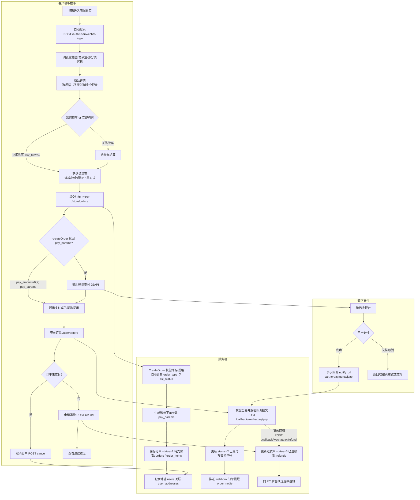

# 01 商城交易链路（C端用户）

> 面向 C 端用户的完整交易主流程。纵向节点串联，泳道区分"客户端小程序动作 / 服务端处理 / 微信支付"。
> 状态字段对齐 `orders.status`：1待支付 → 2已支付 → 3已完成 / 5退款中 / 4已取消 → 6已退款。
>
> 关联文档：[完整业务链路目录](../prd/完整业务链路目录.md) · [PRD-接口文档](../prd/PRD-接口文档.md)

## 关键状态与说明

- **订单主状态 `orders.status`**：1待支付 → 2已支付 → 3已完成 / 5退款中（已发起退款）/ 4已取消 → 6已退款。
- **业务状态 `orders.biz_status`**：服务/租赁类订单下单时按商品类型自动写入（如待接单），普通商品为 0。
- **订单类型 `orders.order_type`**：1普通商品、2租赁商品、3即时服务、4预约服务、5上门服务、6到店服务。
- **押金 `orders.deposit_status`**：0无押金、1已收（租赁下单含押金）、2已退、3部分扣除。
- **支付身份**：服务端以 `app_mode`（sp_app/sub_app）选择对应 appid 发起 partnerpayments/jsapi 下单，回调走 `/api/v1/callback/wechatpay/pay`。
- **相关表**：`orders`、`order_items`、`refunds`、`user_addresses`、`users`。