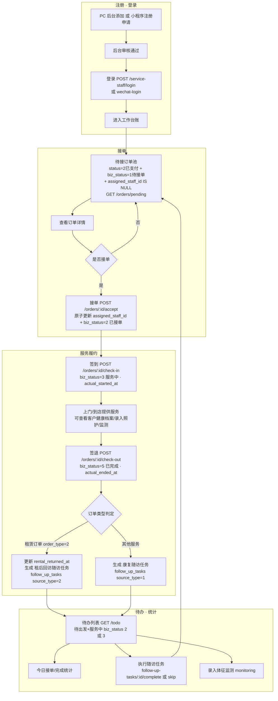

# 02 服务人员工单链路（服务人员端）

> 服务人员从登录到接单、履约、签退并触发随访的完整流程。
> 业务状态字段对齐 `orders.biz_status`：0无 → 1待接单 → 2已接单 → 3服务中 → 5已完成 / 6已取消。
>
> 关联文档：[PRD-功能说明](../prd/PRD-功能说明.md) · [PRD-接口文档](../prd/PRD-接口文档.md)

## 关键状态与说明

- **业务状态 `orders.biz_status` 流转**：待接单(1) → 已接单(2) → 服务中(3) → 已完成(5)；取消为 6。
- **接单原子性**：仅在 `status=2 且 biz_status=1 且 assigned_staff_id IS NULL` 时可通过 UPDATE 抢占接单，避免并发重复接单。
- **签退触发随访**（见 [workorder.go](../../server/internal/handlers/service_staff/workorder.go) 与 [auto.go](../../server/internal/services/followup/auto.go)）：
  - 租赁订单（`order_type=2`）→ 租后回访随访（source_type=2）；
  - 普通服务 → 康复随访（source_type=1）；
  - 计划随访时间 = 当前时间 + 72 小时，失败仅记录不影响签退主流程。
- **服务人员职责边界**：不执行订单核销与退款，仅负责接单、履约、签退。
- **相关表**：`orders`、`order_items`、`service_staffs`、`follow_up_tasks`、`care_visits`、`health_monitoring`。