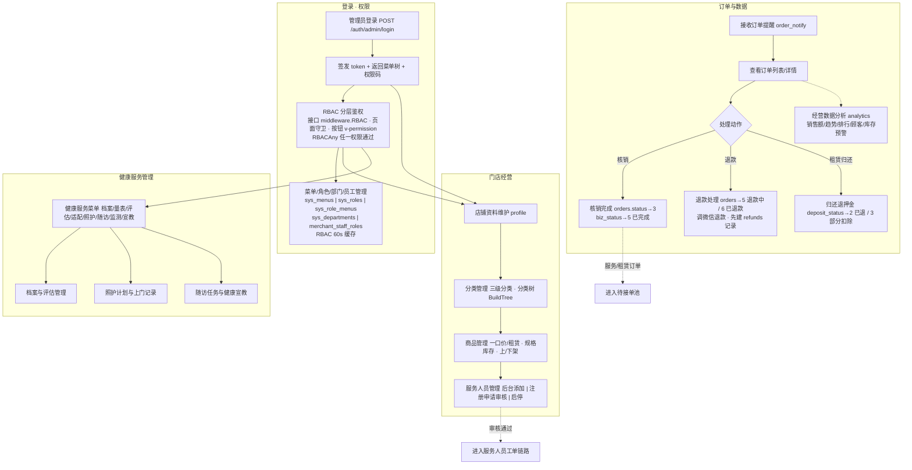

# 03 商户后台管理层（web-admin）

> 单商户 PC 后台经营管理与系统管理主流程。RBAC 三层权限闭环（接口 middleware.RBAC / 页面路由守卫 / 按钮 v-permission）。
>
> 关联文档：[PRD-功能说明](../prd/PRD-功能说明.md) · [PRD-接口文档](../prd/PRD-接口文档.md)

## 关键状态与说明

- **RBAC 三层权限闭环**：
  - 接口级：`middleware.RBAC("order:view")` 注入 `/merchant/*` 路由，无权限返回 403；
  - 页面级：vue-router 守卫按菜单/权限重定向；
  - 按钮级：`v-permission` 指令移除无权限按钮。
- **订单处理状态**（`orders.status`）：核销 2→3 已完成；退款 2→5 退款中→6 已退款；取消 4。
- **退款时序**：先创建 `refunds` 记录，再调用微信退款接口（回调 `/callback/wechatpay/refund`），保证落库与对账一致。
- **租赁归还退押金**：填写扣除金额与验机备注 `rental_return_remark`，更新 `deposit_status` 与退还/扣除金额。
- **相关表**：`orders`、`orders_items`、`refunds`、`categories`、`products`、`service_staffs`、RBAC 五表、健康九表。