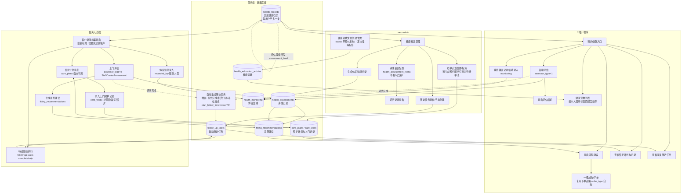

# 04 健康服务闭环（基层健康服务）

> "健康档案 → 人群评估 → 辅具适配 → 居家照护 → 持续随访 → 慢病宣教"连续闭环，体现三端（C端 / 服务人员端 / web-admin）数据流转。
> 状态常量对齐 `server/internal/utils/constants.go`。
>
> 关联文档：[健康闭环 Spec](../../.trae/specs/build-health-service-closed-loop/spec.md) · [PRD-功能说明](../prd/PRD-功能说明.md)

## 关键状态与说明

- **居民健康档案 `health_records.status`**：0未建档 / 1正常 / 2已归档；`chronic_tags`（慢病标签数组）支撑宣教定向与随访计划。
- **评估 `health_assessments.assessor_type`**：1自助（C端）/ 2服务人员；表单 `health_assessment_forms.status`：0草稿/1启用（草稿对端不可见）。
- **评估结论回写**：评估完成后将 `total_score/level/conclusion/suggestions` 回写 `health_records.assessment_level` 与 suggestions。
- **辅具适配 `fitting_recommendations.status`**：0草稿 / 1已确认 / 2已下单，可选择关联商品，C端一键加购复用下单链路。
- **照护 `care_plans.status`**：0草稿 / 1执行中 / 2暂停 / 3完成；`care_visits` 记录护理项/生命体征/照片。
- **随访 `follow_up_tasks`**：触发节点为服务完成（source=1）、租赁归还（source=2）、评估完成（source=3）、手动（source=4）；状态 0待执行/1完成/2跳过；计划随访时间 `now + 72h`。
- **数据权限隔离**：健康档案/评估/监测仅本人（C端）、服务过的客户（服务人员）、管理员（web-admin）可见。
- **相关表**：健康九表 + `orders`（适配/照护关联） + `users`（档案主体）。