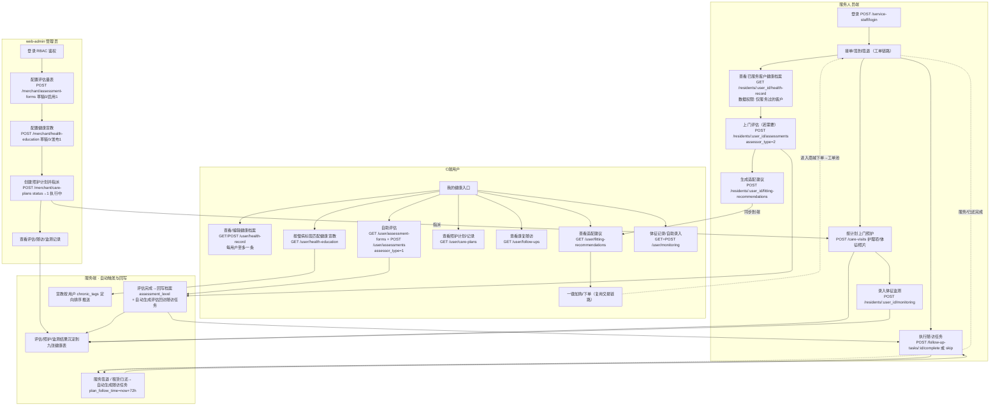

# 05 健康服务业务流程（三端实战时序）

> 从"使用者怎么操作"视角梳理健康服务完整业务流程，跨 C端 / 服务人员端 / web-admin 三端，标注关键接口。
> 该图聚焦『如何使用』的动作与接口调用顺序；数据结构与状态常量见 [04-健康服务闭环](./04-健康服务闭环.md)。
>
> 关联文档：[PRD-接口文档](../prd/PRD-接口文档.md) · [PRD-功能说明](../prd/PRD-功能说明.md)

## 关键流转说明（使用者视角）

1. **web-admin 先配置**：量表（启用后对端可见）、宣教（发布后 C 端可见）、照护计划（指派服务人员）。
2. **服务人员上门**：接单 → 查看客户档案（仅服务过的客户）→ 依需评估/照护/监测/随访。
3. **C 端自助**：查看档案、自测评估、按适配建议加购下单、查看照护与随访、定向宣教。
4. **自动闭环**：评估完成回写档案等级并生成随访；服务/租赁归还签退自动生成随访任务（now+72h）；宣教按 `chronic_tags` 定向。
5. 服务人员在 C 端用户下单后进入工单链路（见 [02-服务人员工单链路](./02-服务人员工单链路.md)）。

## 数据权限隔离

- 服务人员仅能访问自己服务过的客户健康数据（`assigned_staff_id` 数据域校验）。
- C 端用户仅能访问本人档案/评估/监测/随访/适配。
- web-admin 管理员可全量查看与管理。